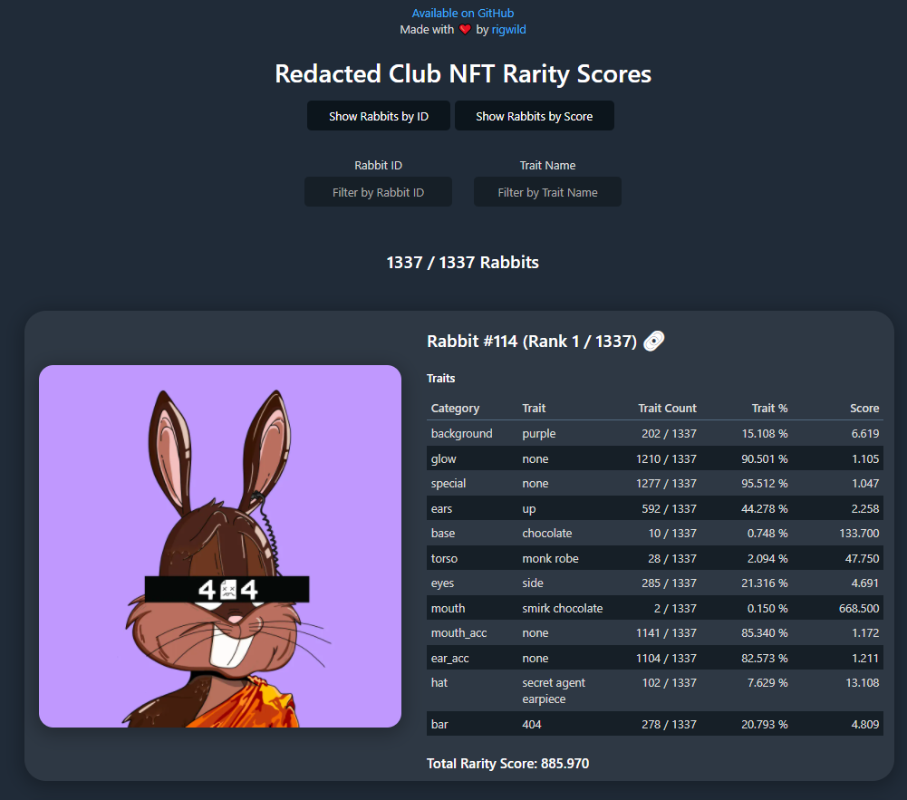

# Redacted Club NFT Rarity Scores

**Note:** This is a direct fork of https://github.com/rigwild/anons-secret-nft

This repository will list every rarity score for each Redacted Club NFTs from https://redactedclub.com/ on the [Secret Network](https://scrt.network/).

The rarity score is calculed following [these formulas (`Rarity Score: How is it Calculated?` section)](https://raritytools.medium.com/ranking-rarity-understanding-rarity-calculation-methods-86ceaeb9b98c#2942).

A rarity score can be calculated in a lot of different ways with each their specifics strengths and flaws. **This is not an official ranking.**

Any non-traits is treated like it was the trait `none`. **It counts in scores**.

## Raw Rarity Scores

- Human-readable version: [`_output_results.log`](./_output_results.log)
- JSON:
  - [`_output_elementsNullTraitsAsNone.json`](./_output_elementsNullTraitsAsNone.json): Elements with `null` traits set to `none`
  - [`_output_rarity.json`](./_output_rarity.json): Rarity scores
  - [`_output_elementsWithRarity.json`](./_output_elementsWithRarity.json): Elements with its rarity

## Reproduce calculations

```sh
pnpm install
pnpm build
pnpm extractTraits
pnpm exportScores
```

If the generated [`_output_elementsWithRarity.json`](./_output_elementsWithRarity.json) file has not changed, you are sure I did not cheat by manually editing it!

SHA256 hashes:

```
$ sha256sum _*
d7d3d09bc5a97dd765660f1c320a42362079d08c2810d55fda2ae1f7a78b487e  _input_elements.json
7e9571d17dbccaf716d96594a19b28f23f07175cc4e547b92a2982633d58b905  _input_traits_background.json
ed05befecb69320353cc7582fb12327f6fef28137a8d5fd7452f470f9753b10f  _input_traits_bar.json
c0b6cafb410fec3a5e2129d98494bed1cfd858670db6f3e39024b5e75bcd4abd  _input_traits_base.json
43d1028bf45d20712e10526e22508f3518c01c9e9233c1d4ab302a1e9934b020  _input_traits_ear_acc.json
0182355f3ca3ebd3a43465fe25ba68b9afa9b946738482f88aabf950edc568a4  _input_traits_ears.json
69f5dff5e936f09f9ecf9e4d57357b96a04109c0a5c0e56137e12b9b7c730595  _input_traits_eyes.json
2c26bd9c20edb1bd5c9708fe9f8b54cb53d302b4e6edfd6de5cc82b4bc042fd1  _input_traits_glow.json
156a84ab11095bcc16335df0e29d54763017d2d31002615e22399ee7692f4d97  _input_traits_hat.json
41ae0622bbd3d74bf0f889e5edcedbfdf7dd01b1b6e299d5e5a3a407bc06fdc9  _input_traits_mouth_acc.json
602a8f8639b930ab5fcd273257fd844b0e9558cded8e4e7e982fea91635729cd  _input_traits_mouth.json
90cdd50cb7c45e8bebfbea62a80955d3264e2f2bc9216be1474b0103826ce984  _input_traits_special.json
68d4580b57b094387d70fc2845672b3404c88e8b495095072e53e7d7a354d7a5  _input_traits_torso.json
10d32ec30759d286ee8e5341c132d0bad87c110d7366cdd88aff10e93fda92db  _output_elementsNullTraitsAsNone.json
b766150122b582a7ebeab6590ff423320f4ebf758fcf83b32ef2e3482226b8dc  _output_elementsWithRarity.json
91ed6e9963cf0208437910ed9fcc132d2a3efc828d6c91d67ab7c8c5594e631d  _output_rarity.json
a7e8d6db729202c309e2108bbea24f3fc6c38152d63af2d681fa5c308cbce851  _output_results.log
```

## Website

A website is available at https://redacted.rigwild.dev/



## License

[The MIT License](./LICENSE)
